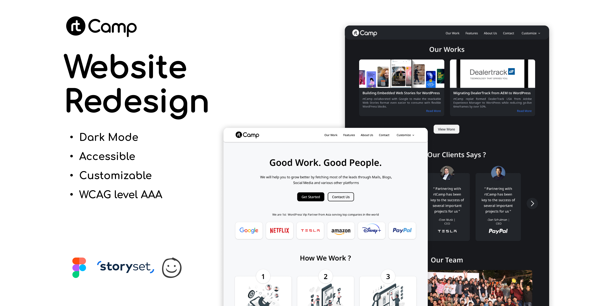

A simple landing page of RTCamp. This project is made from a figma design file. The design file is made by [MOHIT RAMDHAM](https://www.figma.com/community/file/1237017696609995644/RT_Camp-Website-Redesign).

## Getting Started

First time you see this repository, you must clone it and then run the following command:

### `npm install`

Then, you can run

### `npm run dev`

Tech stacks:

-   Vue3 & Vite
-   TailwindCSS
